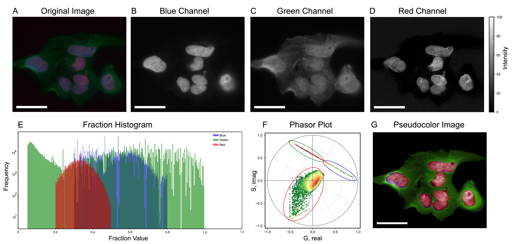
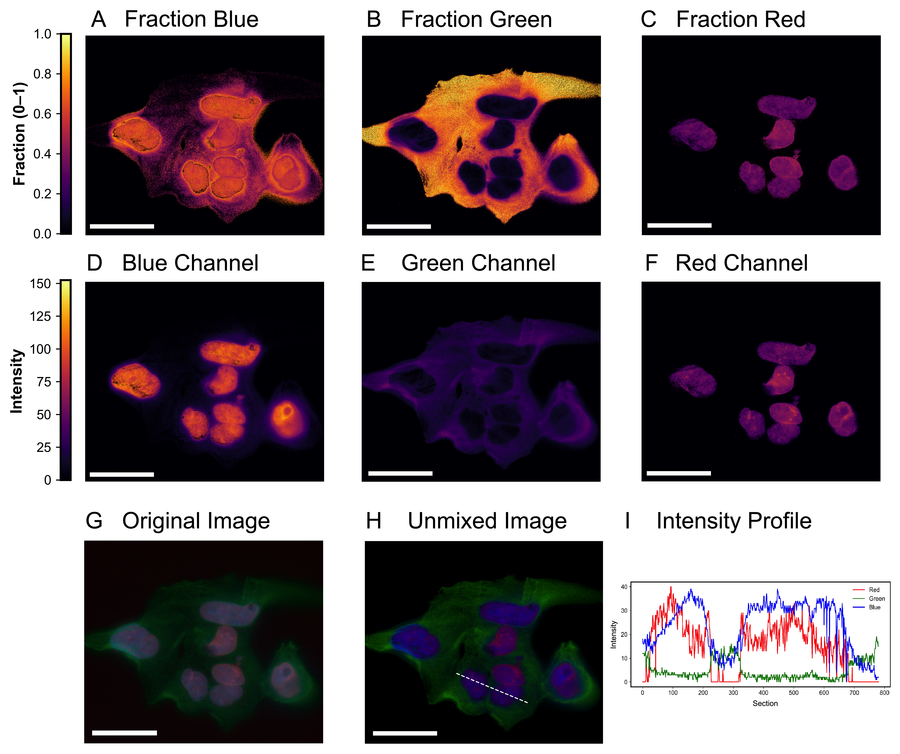

# RGB-Phasor: A Unified Phasor Framework for RGB Microscopy

This repository implements the **RGB-Phasor framework**, a simple and reproducible method to map **RGB images** into **phasor space** and extract meaningful spectral information from standard microscopy images.

Originally conceived for the upcoming RGB-Phasor paper, this project demonstrates how **phasor analysis**—traditionally used in hyperspectral imaging and FLIM—can be applied to **standard RGB images** for segmentation, unmixing, and quantitative analysis.

---

## 🔭 What Is RGB-Phasor?

Phasor analysis transforms pixel intensities into a geometric representation in **(G, S) Fourier space**.  
For RGB images, the three color channels are treated as a discrete spectrum, allowing:

- **Spectral visualization**  
- **Unsupervised segmentation** via clustering  
- **Spectral unmixing** from a single RGB snapshot  
- **Quantitative metrics** (entropy, dispersion, histograms)

Example of the **simulated RGB color wheel** and its **phasor map**:


> *Simulated RGB color wheel → phasor transformation → cursor selection → clustering → spectral unmixing.*

---

## 🧬 Applications Demonstrated

The framework was validated across three major microscopy modalities:

### **1. Label-Free Autofluorescence Imaging**
RGB autofluorescence images (nevus vs melanoma) show measurable **spectral heterogeneity** in phasor space.

### **2. Brightfield Histology (H&E)**
RGB H&E images of lung tissue can be segmented in phasor space to quantify tissue/airspace structure.

### **3. Multicolor Fluorescence Microscopy**
Phasor-based unmixing separates overlapping fluorophores (e.g., DAPI, Laminin-488, NucRed) from a *single* RGB image.

Fluorescence unmixing example:



Fig. (A) Original RGB image of the sample. (B–D) Individual blue, green, and red channels extracted from the RGB image. (E) Histograms of pixel intensity distributions for each channel shown in (B–D). (F) Phasor plot of the RGB image, illustrating the distribution of pixels and the selected cursor positions used to define spectral regions. (G) Pseudocolor representation generated by assigning pixel clusters from the phasor plot in (F) to their corresponding regions in the image. The scale bar represents 50 um. 


Fig. (A–C) Unmixed fractions for the blue, green, and red components. (D–F) Intensity maps of the unmixed blue, green, and red channels. (G) Original RGB image. (H) Reconstructed unmixed RGB image with a dashed white line indicating the region selected for intensity profiling. (I) Intensity profiles of the unmixed RGB channels along the line drawn in (H), showing the spatial distribution and relative overlap of the components. The scale bar represents 50 um. 

---

## 📁 Repository Structure
```bash

├── part4.py                # Main script: RGB phasor analysis + unmixing
├── tools.py                # Core helper functions
├── tools4.py               # Fluorescence-specific utilities
├── paper/                  # Paper figures and raw data
├── docs/                   # Website + tutorials
│   └── assets/
│       ├── simulations.png
│       └── unmixing.png
└── output/                 # Generated figures

```

## ⚙️ How the Method Works

1. Load RGB images  
2. Convert RGB → BGR (phasor convention)  
3. Compute **phasor coordinates (G, S)** with `phasor_from_signal`  
4. Estimate pure components or use phasor cursors  
5. Apply:
   - **Clustering** (k-means, GMM)
   - **Spectral unmixing** (`phasor_component_fit`)  
6. Visualize:
   - Phasor histograms  
   - Fraction maps  
   - Pseudocolor segmentations  
   - Photon-based unmixed RGB images  

---

## 📦 Requirements

Necessary dependencies:

```bash
numpy
matplotlib
scikit-image
scikit-learn
phasorpy
tifffile
```

Install with:

```bash
pip install -r requirements.txt
```

💡 Notes & Tips
	•	Thresholds depend on illumination/staining; tune them for each dataset.
	•	phasor_component_fit enables single-image spectral unmixing.
	•	Extend the method with entropy, PCA, superpixels, or deep learning.
	•	Web documentation will be published upon paper submission.

📄 License

MIT License 

🤝 Citation

If you use this repository, please cite:

Schuty B.R., Malacrida L. et al.
RGB-Phasor: Phasor analysis for spectral interpretation of RGB microscopy images.
(Manuscript in preparation)