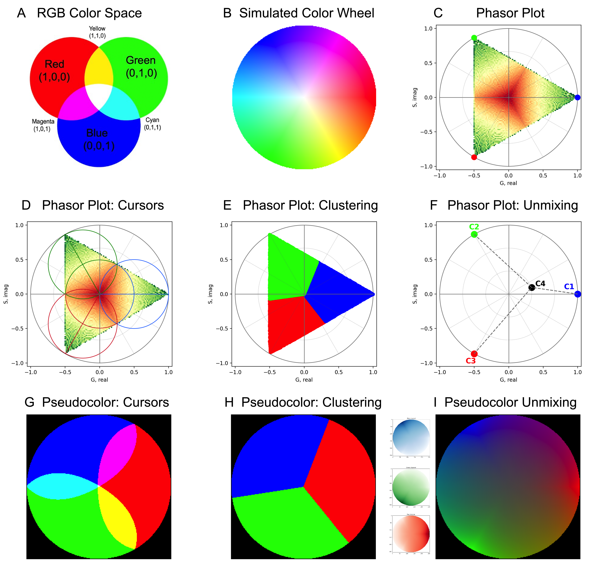

# RGB-Phasor: Theory and Overview

## Introduction and Motivation

Optical microscopy is central to biomedical research, providing detailed insight into tissue and cellular structure.  
Advanced imaging techniques such as hyperspectral imaging (HSI), fluorescence lifetime imaging (FLIM), and multiphoton microscopy have dramatically expanded the amount of information that can be extracted from biological samples.  
However, these methods often generate large multidimensional datasets that require complex processing to interpret [1,2].

The **phasor approach** was originally developed to simplify such analysis by transforming spectral or lifetime data into a two-dimensional Fourier representation defined by cosine (**G**) and sine (**S**) coordinates [2–4].  
In this phasor space, pixels or regions with similar emission or temporal behavior naturally cluster together, enabling intuitive visualization, spectral unmixing, and segmentation without any fitting or model assumptions.  
This “model-free” property has made phasor analysis a standard in FLIM and HSI studies [3,5].

Despite its success, phasor analysis remains limited to laboratories with specialized hardware and software.  
In contrast, **RGB microscopy**—based on red, green, and blue color channels—is ubiquitous, cost-effective, and embedded in nearly every biological imaging workflow, from histology to cell culture.  
Although RGB data are often considered spectrally coarse, they still encode meaningful spectral structure.  
The **RGB-Phasor** framework leverages this latent information to perform phasor analysis directly from standard color images, opening high-content analysis to virtually any microscope or camera.

By transforming RGB intensities into phasor coordinates, this method provides a geometry-based view of color relationships that is invariant to overall brightness.  
It allows unsupervised segmentation, spectral unmixing, and feature extraction using only conventional RGB data—bridging the gap between advanced spectral imaging and routine microscopy.

---

## Phasor Fundamentals for Spectral Imaging

In classical spectral phasor analysis, each pixel’s emission spectrum \(I(\lambda)\) is projected onto the first harmonic of a discrete Fourier transform:

\[
G = \frac{\sum I(\lambda)\cos(2\pi\lambda/\lambda_\text{max})}{\sum I(\lambda)}, \quad
S = \frac{\sum I(\lambda)\sin(2\pi\lambda/\lambda_\text{max})}{\sum I(\lambda)}.
\]

Each spectrum becomes a single point \((G,S)\) in the phasor plot.  
Spectra with similar shapes cluster together, while linear mixtures fall along straight lines connecting their pure components.  
This graphical property makes the phasor plot a compact, visual representation of spectral composition and mixture behavior [1,2,4].

!!! info "Why the phasor plot is circular"
    The phasor plane can be interpreted as a **unit circle**, where every pure wavelength corresponds to a point along the circumference according to its phase.  
    Shorter wavelengths (blue-shifted) map to higher phases, while longer wavelengths (red-shifted) lie on the opposite side.  
    When multiple emissions combine, their resulting point lies at the **vector average** of their individual coordinates, producing trajectories within the circle that reflect spectral mixtures.  

**Key geometric properties:**
- **Linear combination rule:** the phasor of a mixture is the weighted average of its components.  
- **Distance and angle:** represent spectral differences and shifts.  
- **Clustering:** pixels with similar spectral signatures form compact regions in phasor space.  

Phasor analysis thus serves as a universal framework for describing optical signals—whether temporal (FLIM), spectral (HSI), or, as we show next, color-based (RGB).

---

## The RGB-Phasor Concept

In the **RGB-Phasor** formulation, the red, green, and blue channel intensities of each pixel are treated as a discrete spectrum with three sampling points.  
Applying the same first-harmonic transform yields two phasor coordinates that capture the relative spectral composition of the pixel.  
This compact representation transforms a color image into a structured map of spectral relationships rather than simple intensity values.

Unlike direct RGB clustering, the phasor approach encodes the *geometry* of color mixtures, offering:
- invariance to illumination and scaling,
- a continuous mapping between pure colors and mixtures,
- and compatibility with segmentation and unmixing algorithms previously designed for hyperspectral or FLIM data.

Below, the simulated RGB-Phasor diagram illustrates how combinations of red, green, and blue intensities map to characteristic trajectories in phasor space.  
These trajectories correspond to predictable physical mixtures and can be directly linked to the spectral behavior of biological samples.

*Figure 1 — RGB-Phasor simulation and color-space representation.*

The RGB-Phasor framework maps standard color information into a geometrically interpretable phasor plane.  
(A–B) show the conventional RGB color cube and its simulated color wheel.  
(C–D) illustrate how pure colors (R, G, B) and their combinations (C, M, Y) occupy specific positions in the phasor plot, where mixed colors appear as linear trajectories between primary components.  
(E–F) demonstrate clustering and spectral unmixing using Gaussian mixture models, confirming the linear-combination property of the phasor space.  
(G–I) display pseudocolor reconstructions obtained from phasor selections and unmixed components, revealing how spectral structure can be retrieved directly from RGB data.

For practical examples and code, see the [Getting Started Tutorial](../tutorials/01_getting_started.ipynb).

---

## References

[1] Malacrida L. *Nat. Methods* 20 (2023) 965–967.  
[2] Fereidouni F., Bader A.N., Gerritsen H.C. *Opt. Express* 20 (2012) 12729–12741.  
[3] Digman M.A. et al. *Biophys. J.* 94 (2008) L14–L16.  
[4] Ranjit S. et al. *Nat. Protoc.* 13 (2018) 1979–2004.  
[5] Torrado B., Malacrida L., Ranjit S. *Sensors* 22 (2022) 999.  
